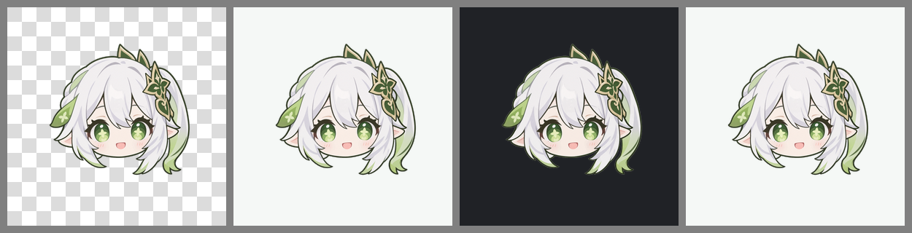

# 正式版 1.7 · 更新日志

**上一版**：正式版 1.6.2
**定型提交**：见本文件所在提交

```bash
git checkout 正式版1.7     # 或 release-v1.7
```

本版把应用图标换成了自定义角色（透明底），并留下可重复执行的生成脚本。

---

## 图标

### 效果



从左到右：透明格底（确认真的透明）/ 浅色底 / 深色底 / 圆形裁剪。
三种背景都能看，圆形裁剪下角色完整。

### 不能直接用原图

原图有三个问题，直接换上去会很难看：

| 问题 | 实测数据 | 后果 |
|---|---|---|
| 内容贴边 | 宽 94.9%、高 94.5%，**左边距 0、下边距 0** | 系统裁圆时**头发两侧被切掉** |
| 内容不在画布正中 | alpha 边界 `(0, 69, 1190, 1254)` | 直接缩放会偏心、偏小 |
| 原图自带白底 | 与角色的白发糊在一起 | 看不出轮廓，像一团白 |

### 处理方式

1. **按 alpha 边界裁剪**，去掉原图自身不规则的留白
2. **等比缩放到画布的 67%** —— 与工程里原有的 `foreground.png` 一致的安全比例
   （那个官方模板的内容也占 45%~67%，正是为了不被裁）
3. **居中贴到透明画布**，留出安全区
4. **背景层做成全透明**（用户要求：图标就是角色本身，不要底色）

### 改了哪些文件

```
AppScope/resources/base/media/foreground.png     ← 角色，透明底，内容占 67%
AppScope/resources/base/media/background.png     ← 全透明
entry/src/main/resources/base/media/foreground.png
entry/src/main/resources/base/media/background.png
entry/src/main/resources/base/media/startIcon.png ← 角色本身（启动/快捷方式用，不分层）
```

**两处 media 目录都要写**：`AppScope` 是应用级图标、`entry` 是模块级。
只改一个会出现「某个地方还是旧图标」。

背景层现在是 4 KB（1024×1024 全透明，压缩后极小），替换掉了原来
89.8 KB 的默认蓝色底。

---

## 生成脚本

图标不是手工处理的，而是脚本生成 —— 以后想调大小/换底只改一处：

```
tools/make_icon.py       # 唯一来源，改完重跑
tools/make_preview.py    # 出预览图（透明格 / 浅底 / 深底 / 圆形）
```

```bash
python tools\make_icon.py
python tools\make_preview.py
```

**可调参数**（在 `make_icon.py` 顶部）：

```python
CANVAS = 1024          # 画布尺寸
CONTENT_RATIO = 0.67   # 角色占画布的比例
                       # 调到 0.72~0.75 会更大，但圆角裁剪切边风险上升
```

背景想改色就改 `make_background()` 的返回值（现在返回全透明）。

> 脚本里用的是 `tools\make_icon.py` 顶部那个本地图片路径。
> 如果原图删了，重新生成前要先把路径指过去。

---

## 验证

真机确认图标显示正常。预览图覆盖了三种背景与圆形裁剪，
四种形态下角色都完整未被裁切。
